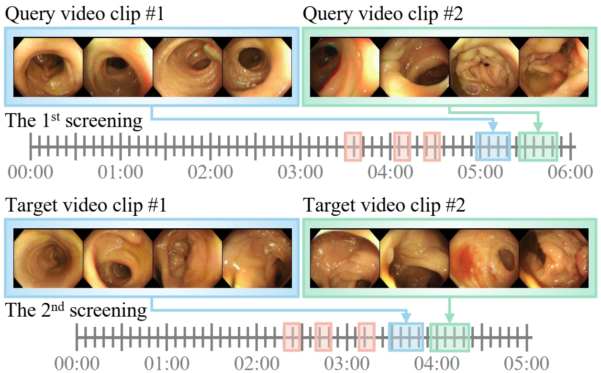

# Gated Progressive Fusion Network for Polyp Re-Identification

## Introduction

we propose a novel architecture, named Gated Progressive Fusion (GPF-Net),  to selectively fuse features from multiple levels using gates in a fully connected way for polyp re-identification, which can effectively enhance the features at each level by higher-level features with stronger semantics and lower-level features with more details, and gates are used to control the propagation of useful information which significantly reduces the noises during fusion. On the basis of it, a gated progressive fusion strategy is introduced to achieve layer-wise refinement of semantic information through multi-level feature interactions. Experiments on standard benchmarks show the benefits of the multimodal setting over state-of-the-art unimodal ReID models, especially when combined with the specialized multimodal fusion strategy.

<!--  -->

### News
- Support Market-1501, DukeMTMC, CUHK03 and Colo-Pair datasets.

## Installation

TorchMultimodal requires Python >= 3.7. The library can be installed with or without CUDA support.
The following assumes conda is installed.

## Instruction
Modify the data path of the code according to your dataset, then perform the following command:
```
bash trainer.sh
```
'train_fold' controls the n-fold Cross Validation.
 
## Contributing
See the [CONTRIBUTING](CONTRIBUTING.md) file for how to help out.


## Acknowledgments
This work was supported by the National Natural Science Foundation of China under Projects (Grant No. 62301315).
If you have further questions and suggestions, please feel free to contact us (xiangsuncheng17@sjtu.edu.cn).

If you find this code useful in your research, please consider citing:
```
@article{xiang2024deep,
  title={Deep Multimodal Collaborative Learning for Polyp Re-Identification},
  author={Xiang, Suncheng and Li, Jincheng and Zhang, Zhengjie and Cai, Shilun and Guan, Jiale and Qian, Dahong},
  journal={arXiv preprint arXiv:2408.05914},
  year={2024}
}
```
